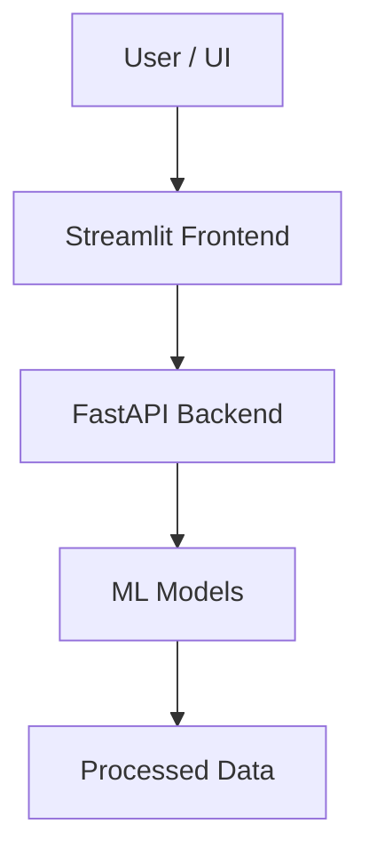

# 🛍️ E-Commerce Recommender System

### Hybrid ML + Production Deployment (FastAPI • Streamlit • Docker)

<p align="center">
  
  
  
  
  
  
</p>

---

## 🚀 Project Overview

A **production-grade hybrid recommender system** designed for e-commerce platforms, combining:

* 📊 Collaborative Filtering (SVD)
* 🧾 Content-Based Filtering (TF-IDF)
* ⚡ Real-time inference via REST APIs
* 🐳 Fully containerized deployment

> ⚠️ This is not just a notebook project — it is a **deployable ML system** with clear separation of concerns.

---

## 🧠 Problem Statement

Traditional recommendation systems suffer from:

* Cold-start problem ❄️
* Sparse interaction matrices 📉
* Limited personalization 🎯

### 💡 Solution

A **hybrid recommendation engine** that:

* Learns user-item interactions (CF)
* Understands item similarity (Content-based)
* Combines both for robust predictions

---

## 🏗️ System Architecture



---

## 📂 Project Structure

```bash
E-Commerce_Recommender_System/
│
├── API/                # FastAPI (inference layer)
├── FRONTEND/           # Streamlit UI
├── Models/             # Serialized models (.pkl)
├── Data/               # Processed datasets
├── Functions/          # Utility modules
├── Notebook/           # Research (excluded in prod)
│
├── Dockerfile          # Single-container deployment
├── requirements.txt
└── README.md
```

---

## ⚙️ Tech Stack

| Layer      | Technology                |
| ---------- | ------------------------- |
| ML Models  | Scikit-learn, SVD, TF-IDF |
| Backend    | FastAPI, Uvicorn          |
| Frontend   | Streamlit                 |
| Deployment | Docker                    |
| Data       | Pandas, NumPy             |

---

## 🧪 Model Design

### 🔹 Collaborative Filtering

* Matrix factorization using **SVD**
* Captures latent user preferences

### 🔹 Content-Based Filtering

* TF-IDF vectorization
* Computes item similarity

### 🔹 Hybrid Strategy

* Combines both scores for improved accuracy
* Mitigates cold-start & sparsity issues

---

## ⚡ API Design

Example endpoint:

```http
GET /recommend?user_id=1
```

### Response:

```json
{
  "recommendations": ["item_1", "item_2", "item_3"]
}
```

---

## 🐳 Docker Deployment

### 🔹 Build

```bash
docker build -t recommender-system .
```

### 🔹 Run

```bash
docker run -p 8000:8000 -p 8501:8501 recommender-system
```

---

## 🌐 Access

* 🎨 Frontend → http://localhost:8501
* 📡 API Docs → http://localhost:8000/docs

---

## 📈 Key Highlights (Recruiter Focus)

* ✔ End-to-end ML pipeline (data → model → deployment)
* ✔ Hybrid recommender system (non-trivial ML design)
* ✔ REST API for real-time inference
* ✔ Dockerized system (production mindset)
* ✔ Clean modular architecture

---

## 🧩 Design Decisions

* **FastAPI over Flask** → async + performance
* **Streamlit** → rapid prototyping for UI
* **Docker** → reproducibility + deployment readiness
* **Hybrid model** → better generalization

---

## 🚀 Future Work

* Neural Collaborative Filtering (Deep Learning)
* Online learning with user feedback
* Redis caching for low-latency inference
* Deployment on AWS / Kubernetes
* A/B testing recommendation strategies

---


<p align="center">
  ⭐ If you found this useful, consider starring the repo!
</p>
